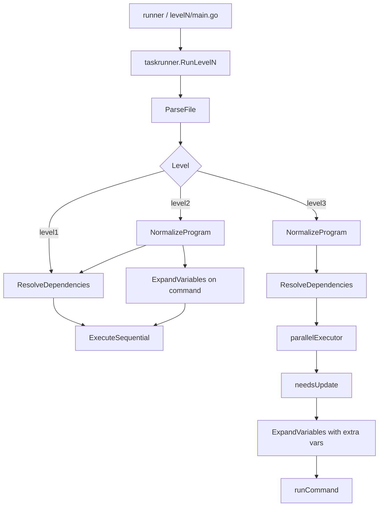

# Go Task Runner

このディレクトリには、Go によるタスクランナーの実装がレベル別に格納されています。  
各レベルは同じ `runner` を使い、内部の実装だけを段階的に拡張しています。

## ディレクトリ構成

- `builder`: 全レベルを一括でビルドするスクリプト
- `runner`: レベル番号を受け取り、対応するバイナリを実行する入口
- `level1/`: 基本の依存解決と順次実行
- `level2/`: 変数展開
- `level3/`: 自動変数、タイムスタンプ、並行実行
- `taskrunner/`: レベル間で共通の実装本体
- `dist/`: `builder` によるビルド出力

## 実装の考え方

Go 側の共通処理は [taskrunner](./taskrunner) パッケージにまとめています。  
各レベルの `main.go` は薄い入口で、引数を受け取って `taskrunner.RunLevelN` を呼ぶだけです。

共通化している主な処理は次のとおりです。

- `ParseFile`: Taskfile の読み込み
- `NormalizeProgram`: 変数展開済みの実行向けデータへの正規化
- `ResolveDependencies`: DFS による依存順の決定
- `ExecuteSequential`: level1 / level2 の直列実行
- `RunLevel3`: level3 の並行実行

## 処理の流れ



level1 は `ParseFile -> ResolveDependencies -> ExecuteSequential` の直列処理です。  
level2 はその前に `NormalizeProgram` を挟んで変数展開を加えます。  
level3 はさらに `parallelExecutor` を挟み、依存が独立していれば並行に進めます。

## Level 1

Level 1 は、依存関係を DFS でたどってトポロジカル順を作り、順番にコマンドを実行します。

特徴:

- 循環依存を検知する
- 既存のファイルは leaf として扱う
- コマンドは `sh -c` で実行する

## Level 2

Level 2 は、Level 1 に変数展開を追加します。

特徴:

- `$(NAME)` 形式の変数を再帰的に展開する
- 環境変数を優先する
- 変数ループを検知する
- 変数展開は実行直前ではなく、正規化段階でも使えるようにしている

実装上の優先順位は次のとおりです。

1. 自動変数などの追加変数
2. 特殊変数の扱い
3. 環境変数
4. Taskfile 内の変数

## Level 3

Level 3 は、自動変数、タイムスタンプ判定、並行実行を追加します。

特徴:

- `$@`, `$<`, `$^` を自動変数として扱う
- `os.Stat` による更新判定を行う
- 依存が独立していれば goroutine で並行に進める
- 同じ target は futures 風の共有状態で二重実行しない

並行実行は、依存がすべて完了したあとに必要なタスクだけを実行する形です。  
同一 target のコマンドは直列、異なる依存は並行です。

## ビルド

```bash
./golang/builder
```

ビルド時は sandbox 環境に合わせて `GOCACHE=/tmp/go-build` を使っています。

## 実行

```bash
./golang/runner level1 samples/01_basic/simple_build.txt
./golang/runner level2 samples/02_variables/01_basic_vars.txt
./golang/runner level3 samples/03_advanced/03_parallel.txt
```

## 統合テスト

```bash
./tools/evaluate.rb golang level1
./tools/evaluate.rb golang level2
./tools/evaluate.rb golang level3
```
